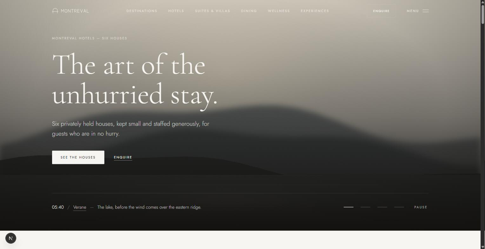

# Blueprint — Hospitality / Luxury

The canonical HubZero Blueprint for the **Hospitality** architecture in the **Luxury** design language.

It is demonstrated through **Montreval Hotels**, a collection of six privately held houses in the Verane Valley, on the Calanera Coast, at Aubris, Sabaia, Tamerin and Lindhavn.

> **Montreval Hotels does not exist.**
> This repository is a HubZero Blueprint. Every house, person, rate, award, guest letter, telephone number and address in it was written for the demonstration. Nothing is adapted from any real company, person or place, and there is no backend behind the site — see [Honest demonstration](#honest-demonstration).



---

## What this blueprint is for

A blueprint is not a template and not a finished client website. It is a production-ready foundation: the architecture, design system, content model and SEO infrastructure a real hotel group's site would need, built so the brand on top of it can be replaced without touching implementation code.

It demonstrates three things at once:

| System | Choice | Where it is defined |
| --- | --- | --- |
| Architecture | Hospitality | `.hubzero/architecture/hospitality.md` |
| SEO | Hospitality | `.hubzero/seo/hospitality.md` |
| Design language | Luxury | `.hubzero/design/languages/luxury.md` |

`.hubzero` is Blueprint Core — canonical HubZero engineering knowledge, synchronised by the HubZero Blueprint CLI. Do not edit it.

---

## Getting started

```bash
npm install
npm run dev
```

The site runs at `http://localhost:3000`.

```bash
npm run lint       # ESLint
npm run typecheck  # tsc --noEmit
npm run build      # production build
npm start          # serve the production build
```

Every route is statically generated. There is no database, no API and no environment configuration beyond `NODE_ENV`.

---

## Folder structure

```
src/
  app/          Routes. One folder per page; [slug] folders are statically generated.
  components/
    layout/     Structural primitives, the floating navigation and the footer
    sections/   Composed page sections reused across routes
    shared/     Blueprint Base primitives (Reveal, JsonLd, SkipLink)
    ui/         The design system: Button, Figure, Type, Prose, SpecList, cards
    home/       The light sequence — this blueprint's signature experience
  config/       site.ts, navigation.ts, metadata.ts, env.ts
  content/      All copy and data, typed. Nothing else in the app hardcodes content.
  hooks/        useDismissible, useInView, useReducedMotion, useScrolled
  seo/          Metadata, JSON-LD, sitemap, robots, manifest
  styles/       tokens.css (Blueprint Base infrastructure) and theme.css (the Luxury layer)
  utils/        cn, navigation helpers, deterministic formatters
public/
  brand/        Logo, brand mark, Open Graph image
  images/       Photography, one file per subject
docs/screenshots/
```

---

## Customising it

Re-branding this blueprint should never require editing a component.

1. **`src/config/site.ts`** — name, tagline, description, URL, contact details, address, asset paths, and the editorial conventions (locale, currency).
2. **`src/config/navigation.ts`** — the primary bar, the full menu and the footer.
3. **`src/content/`** — every word on the site. Each file is typed against `src/content/types.ts`, and `src/content/index.ts` is the only module pages import from.
4. **`src/styles/theme.css`** — colour, typography, motion, corners, borders, shadow and spacing. Brand values are declared once under a `--montreval-*` prefix and mapped onto Blueprint Base's token names and Tailwind's theme. `tokens.css` holds only the infrastructure tokens Base's own components read — the container width and the z-index scale — and theme.css declares outright every token the Luxury language owns.
5. **`public/brand/` and `public/images/`** — replace the files; the paths are referenced through configuration, never hardcoded.

Adding a house, a room, a kitchen or a journal entry means adding an object to the relevant file in `src/content/`. The route, the sitemap entry, the structured data and the index card all follow from it.

---

## Fictional content

All of it is fictional and generated for this blueprint, per `.hubzero/experience/content.md`.

| What | Where |
| --- | --- |
| Six destinations | `src/content/destinations.ts` |
| Six houses | `src/content/hotels.ts` |
| Twelve rooms, suites and villas | `src/content/stays.ts` |
| Eight kitchens | `src/content/dining.ts` |
| Four spas | `src/content/wellness.ts` |
| Eight experiences | `src/content/experiences.ts` |
| Six journal entries | `src/content/journal.ts` |
| Guest letters | `src/content/testimonials.ts` |
| Questions | `src/content/faqs.ts` |
| Weddings, gatherings and venues | `src/content/gatherings.ts` |
| Sustainability figures | `src/content/sustainability.ts` |
| Brand story, people, awards, press | `src/content/brand.ts` |
| Privacy and terms | `src/content/legal.ts` |

Editorial conventions held constant throughout: **British English**, **euros**, **metric**, dates as `14 April 2026`, telephone numbers in international format, and one address convention.

### Imagery

The principal photography is original editorial imagery generated for this repository, with one material and colour palette per place held inside a shared Montreval visual language. High-visibility destination, property, room, dining, wellness and experience slots use optimized WebP photographs; the remaining supporting plates retain the original restrained illustration system. Every asset is sized and cropped for the slot it fills. Replacing `public/images/` with commissioned photography requires no component change. The tooling that produced the assets is not part of the repository, as `.hubzero/experience/branding.md` requires.

---

## Honest demonstration

There is no server behind this site, and it never pretends otherwise.

* No booking engine, no reservation form, no account, no analytics, no cookies.
* Every enquiry route opens the visitor's own telephone or email application. Nothing is collected, stored or transmitted.
* The `/reservations` and `/contact` pages say so above the fold; `/faqs` answers it as its first question; `/privacy` and `/terms` open with it.

This follows `.hubzero/principles.md` — *Honest Demonstration Over Simulated Functionality*. A form that silently discards what it collects would be the one dishonest thing on an otherwise honest website.

---

## Notable implementation details

* **Floating navigation** with two named appearance states derived from scroll position alone — never from route or hero visibility. Every page opens on an ink hero so the surface behind the bar is the same everywhere.
* **The Hour** — the homepage light sequence, the blueprint's one signature interaction: the collection introduced as a single day, from before sunrise at Verane to midnight on the fjord. Cross-fades only; pausable; it does not auto-advance at all under `prefers-reduced-motion`.
* **Deterministic formatters** (`src/utils/format.ts`) rather than `Intl`, so dates and currency render identically on the server and the client.
* **Structured data that reflects reality** — `Hotel`, `Restaurant`, `Article`, `FAQPage`, `BreadcrumbList`, `Organization` and `WebSite`. Deliberately absent: `aggregateRating` and `Review`, because the guest letters are fictional.
* **Lifecycle routes are designed** — the loading, error and not-found routes get the same typography, an accessible live region, a heading hierarchy and a route back.
* **Empty states everywhere a list can legitimately be empty**, rather than a grid that quietly renders nothing.

---

## Licence

MIT — see [LICENSE](LICENSE).

---

## HubZero

This repository is part of the [HubZero](https://hubzero.in) Blueprint ecosystem. Blueprints are production-ready foundations for real businesses, each with its own architecture, design language and identity.

The business depicted here is fictional.
